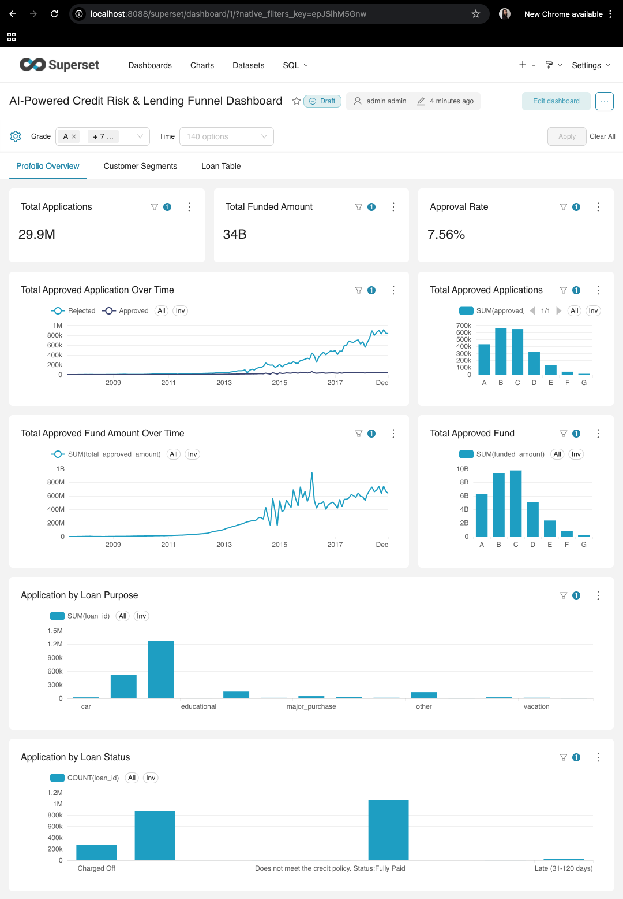
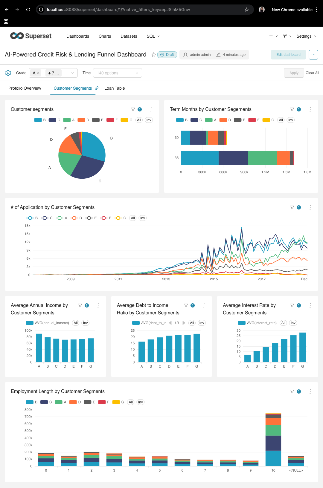
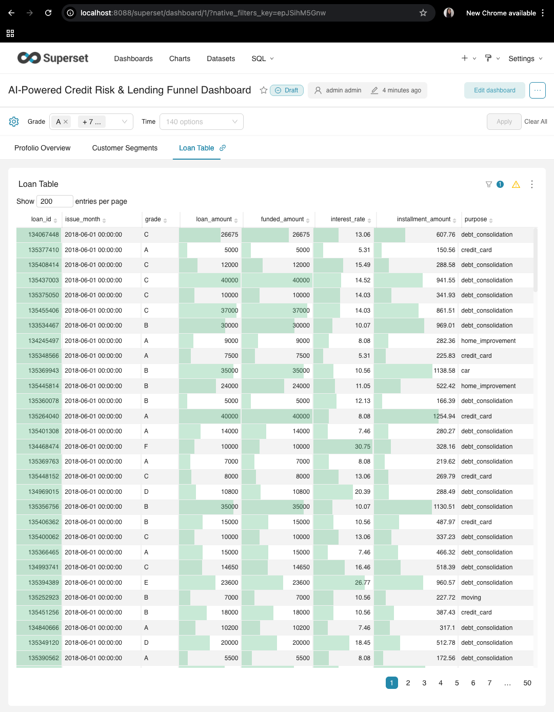

# Finance Platform Analytics Demo

An end-to-end analytics engineering project demonstrating how financial platform data can be transformed into business insights using a modern data stack.

This project showcases how raw lending data can be loaded into PostgreSQL, cleaned and standardized with dbt, processed into analytics-ready models, and explored through Apache Superset dashboards for further analysis.

The pipeline follows a typical analytics workflow:

**Raw Data → PostgreSQL → dbt Models → Apache Superset Dashboards**

## Data Source

The source data comes from the Kaggle Lending Club dataset:

https://www.kaggle.com/datasets/wordsforthewise/lending-club/data?select=accepted_2007_to_2018Q4.csv.gz

This project uses Lending Club accepted and rejected loan application data as the raw input for analytics engineering and BI reporting.

## Project Purpose

The goal of this project is to show a practical end-to-end analytics workflow:

- load raw Lending Club data into PostgreSQL  
- clean and standardize the source data in dbt staging models  
- process the cleaned data into business-ready mart models  
- set up Apache Superset dashboards on top of those models  
- support further analysis of loan performance, risk, status distribution, and portfolio trends  

## Architecture

This project demonstrates a modern **analytics engineering architecture** commonly used in data-driven organizations.

```
Raw Data  
│  
▼  
PostgreSQL Database  
│  
▼  
dbt Models  
(staging → marts transformation)  
│  
▼  
Analytics Layer  
│  
▼  
Apache Superset Dashboards  
```

The stack mirrors real-world analytics platforms used by modern data teams.

## Example Dashboard

Example Apache Superset dashboard views built on top of dbt models.

### Dashboard View 1



### Dashboard View 2



### Dashboard View 3



## dbt Model Document


## Tech Stack

| Tool | Purpose |
|-----|------|
| PostgreSQL | Data warehouse storing platform data |
| dbt (Data Build Tool) | Data transformation and modeling |
| Apache Superset | BI dashboards and visualization |
| Docker | Reproducible development environment |
| Python | Data ingestion and utilities |


## Project Structure

```
Finance-Platform-Analytics-Demo
│
├── dbt/
│ └── lending_platform
│
├── models/
│ ├── staging
│ └── mart
│
├── docker/
│ ├── docker-compose.yml
│ └── superset
│
├── scripts/
│ └── load_loans.py
│
├── sql/
│
├── data/
│ └── raw
│
├── profiles/
│ └── profiles.yml
│
├── requirements.txt
├── dbt_project.yml
└── README.md
```

## Data Modeling Approach

The data transformation layer is implemented using **dbt** and follows a typical analytics engineering structure.

### Staging Layer

The staging layer cleans and standardizes raw source tables.

Examples:

- stg_loans  
- stg_rejected_loans  

Responsibilities:

- column standardization  
- basic transformations  
- source normalization  

### Mart Layer

The mart layer contains business-ready datasets designed for analytics and reporting.

Examples:

- loan_status_summary  
- loan_risk_summary  
- portfolio_overview  

These models power dashboards and analytical queries.

## Workflow

### 1. Load Raw Data

The raw accepted and rejected Lending Club datasets are loaded into PostgreSQL so they can be queried, transformed, and visualized in one place.

The loader script writes raw tables such as:

- `raw.lendingclub_loans`  
- `raw.lendingclub_rejected_loans`  

### 2. Clean and Standardize Data

dbt staging models clean the raw tables by selecting useful columns, standardizing names, and casting fields into consistent types for downstream use.

### 3. Process Analytics Models

dbt mart models aggregate and reshape the cleaned data into business-friendly tables that support reporting and analysis.

### 4. Build Superset Dashboards

Apache Superset connects to the transformed PostgreSQL tables so dashboards can be built for monitoring loan status, loan volume, pricing, and risk-related metrics.

### 5. Perform Further Analysis

Once the data is loaded, cleaned, and modeled, the project can support deeper analysis such as approval trends, rejected application patterns, portfolio summaries, and other lending insights.

## CI/CD

This project includes a simple GitHub Actions setup for dbt-oriented CI/CD.

- CI workflow: `.github/workflows/dbt-ci.yml`
- Deploy workflow: `.github/workflows/dbt-deploy.yml`

The CI workflow:

- starts a temporary PostgreSQL service
- loads a tiny smoke-test dataset from `sql/ci_init.sql`
- runs `dbt parse`
- runs `dbt build`

The deploy workflow is a manual trigger that can run `dbt build` against a target PostgreSQL environment using repository secrets:

- `DBT_HOST`
- `DBT_USER`
- `DBT_PASSWORD`
- `DBT_PORT`
- `DBT_DBNAME`
- `DBT_SCHEMA`

# Running the Project

### 1. Clone the repository

```bash
git clone https://github.com/chiaoya/Finance-Platform-Analytics-dbt-superset-Demo.git  
cd Finance-Platform-Analytics-Demo  
```

### 2. Start PostgreSQL

```bash
cd docker  
docker compose up -d postgres  
```

### 3. Load raw data into PostgreSQL

```bash
python3 scripts/load_loans.py  
```

### 4. Run dbt transformations

```bash
docker compose run dbt debug  
docker compose run dbt run  
docker compose run dbt test  
```

### 5. Launch Superset

Superset connects to the PostgreSQL database to visualize analytics tables and metrics.

Dashboards can be built on top of dbt-generated marts.

The Superset container bootstrap also imports a database connection automatically from a YAML-generated datasource bundle, so rebuilding the container will recreate the `platform_demo` database connection without manual UI setup.

## Example Analytics Questions

The data models enable analysis of key business questions such as:

### Loan Approval Performance

- approval rate trends  
- loan approval processing time  
- approval distribution by segment  

### Platform Conversion Funnel

- application → approval conversion  
- conversion rate by channel or segment  

### Operational Metrics

- loan volume distribution  
- platform activity  
- approval throughput  

## Why This Project

This project demonstrates practical skills used in modern analytics and data engineering teams:

- analytics engineering with dbt  
- data warehouse modeling  
- reproducible environments using Docker  
- building analytics-ready datasets  
- enabling BI dashboards for business users  

The architecture reflects real-world data platform designs.

## Future Improvements

Possible future extensions include:

- automated ingestion pipelines  
- CI/CD for dbt models  
- data quality monitoring  
- expanded Superset dashboards  
- orchestration with Airflow or Dagster  

## Author

### **Chiaoya Chang**

Data Scientist / Analytics Engineer  
Berlin, Germany  

GitHub:  
https://github.com/chiaoya
