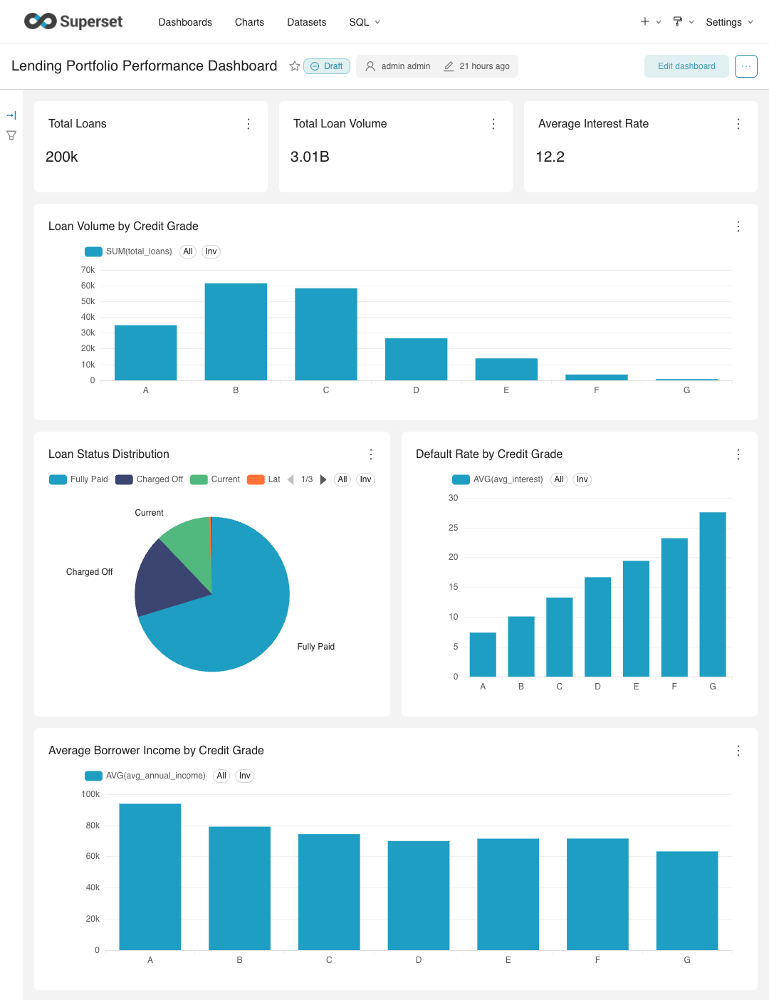
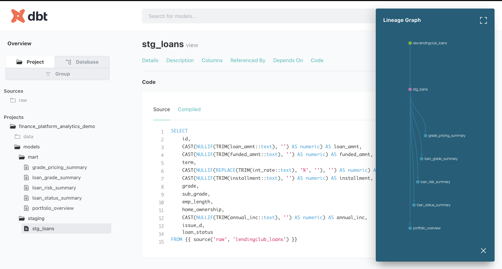

# Finance Platform Analytics Demo

An end-to-end analytics engineering project demonstrating how financial platform data can be transformed into business insights using a modern data stack.

This project showcases how raw platform data can be ingested, modeled, and analyzed to support business decision-making.

The pipeline follows a typical analytics workflow:

**Raw Data → PostgreSQL → dbt Models → Apache Superset Dashboards**

## Architecture

This project demonstrates a modern **analytics engineering architecture** commonly used in data-driven organizations.

```
Raw Data  
│  
▼  
PostgreSQL Database  
│  
▼  
dbt Models  
(staging → marts transformation)  
│  
▼  
Analytics Layer  
│  
▼  
Apache Superset Dashboards  
```

The stack mirrors real-world analytics platforms used by modern data teams.

## Example Dashboard

Example Apache Superset dashboard built on top of dbt models.



## dbt Model Document



## Tech Stack

| Tool | Purpose |
|-----|------|
| PostgreSQL | Data warehouse storing platform data |
| dbt (Data Build Tool) | Data transformation and modeling |
| Apache Superset | BI dashboards and visualization |
| Docker | Reproducible development environment |
| Python | Data ingestion and utilities |


## Project Structure

```
Finance-Platform-Analytics-Demo
│
├── dbt/
│ └── lending_platform
│
├── models/
│ ├── staging
│ └── mart
│
├── docker/
│ ├── docker-compose.yml
│ └── superset
│
├── scripts/
│ └── load_loans.py
│
├── sql/
│
├── data/
│ └── raw
│
├── profiles/
│ └── profiles.yml
│
├── requirements.txt
├── dbt_project.yml
└── README.md
```

## Data Modeling Approach

The data transformation layer is implemented using **dbt** and follows a typical analytics engineering structure.

### Staging Layer

The staging layer cleans and standardizes raw source tables.

Examples:

- stg_loans  
- stg_customers  

Responsibilities:

- column standardization  
- basic transformations  
- source normalization  

### Mart Layer

The mart layer contains business-ready datasets designed for analytics and reporting.

Examples:

- loan_performance  
- approval_metrics  
- platform_summary  

These models power dashboards and analytical queries.

# Running the Project

### 1. Clone the repository

```bash
git clone https://github.com/chiaoya/Finance-Platform-Analytics-dbt-superset-Demo.git  
cd Finance-Platform-Analytics-Demo  
```

### 2. Start PostgreSQL

```bash
cd docker  
docker compose up -d postgres  
```

### 3. Run dbt transformations

```bash
docker compose run dbt debug  
docker compose run dbt run  
docker compose run dbt test  
```

### 4. Launch Superset

Superset connects to the PostgreSQL database to visualize analytics tables and metrics.

Dashboards can be built on top of dbt-generated marts.

## Example Analytics Questions

The data models enable analysis of key business questions such as:

### Loan Approval Performance

- approval rate trends  
- loan approval processing time  
- approval distribution by segment  

### Platform Conversion Funnel

- application → approval conversion  
- conversion rate by channel or segment  

### Operational Metrics

- loan volume distribution  
- platform activity  
- approval throughput  

## Why This Project

This project demonstrates practical skills used in modern analytics and data engineering teams:

- analytics engineering with dbt  
- data warehouse modeling  
- reproducible environments using Docker  
- building analytics-ready datasets  
- enabling BI dashboards for business users  

The architecture reflects real-world data platform designs.

## Future Improvements

Possible future extensions include:

- automated ingestion pipelines  
- CI/CD for dbt models  
- data quality monitoring  
- expanded Superset dashboards  
- orchestration with Airflow or Dagster  

## Author

**Chiaoya Chang**

Data Scientist / Analytics Engineer  
Berlin, Germany  

GitHub:  
https://github.com/chiaoya
EOF
